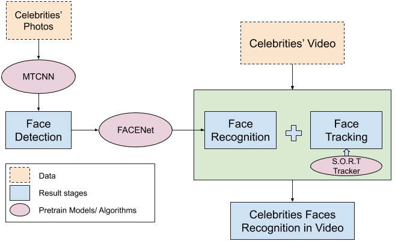

The original repo is in here: https://gitlab.eurecom.fr/longtng/incremental-celebrity-recognition/

# Face-Celebrity-Recognition

This project proposes the approaches for human face recognition, which focus on celebrities or public figures such as politicians, singers, or actors. The system starts training with an initial small data-set of celebrities’ photos with the **pre-train MTCNN model for face detection**. Next, the outcome of the previous stage will be used for **face recognition** task via pre-train **FaceNet model**. The pre-train FaceNet model was trained under **Inception-ResNet-v1 Architecture** with VGGFace2 data-set. In order to test the face recognition accuracy, we have experimented with the embedding output from FaceNet model with different classifiers such as **Random Forest, KNN, SVC or LinearSVC**. Later, we also introduced face recognition for new celebrities’ faces, which do not include in the data-set and using **S.O.R.T algorithm** to improve the accuracy. This training strategy has achieved a solid performance in face recognition in testing videos

**The Suggested Approach:**



### 1. Create raw image directory.
Create a directory for your raw images so that images from different people are in different subdirectories.The name of subdirectory is the label name for that person and each person can have a different the number of images.

```sh
$ tree data/raw
person-1
├── image-1.jpg
├── image-2.png
...
└── image-p.png

...

person-m
├── image-1.png
├── image-2.jpg
...
└── image-q.png
```
### 2. Preprocess the raw images (Face detection)
Face alignment using MTCNN
```sh
python FaceDetector.py  data/training_raw_images data/aligned_face/6_persons --image_size 182 --margin 44
```
### 3. Train a classifier on own images
We perform training a classifier using the following command:
```sh
python classifier.py TRAIN --classifier SVM data/aligned/6_persons model/20180402-114759.pb classifier/11_7_2019/svm_classifier_for_6_persons.pkl --batch_size 200
```
### 4. Perform face recognition on Video
The below command helps us to recognize people from video using the trained classifier from the previous step:
```sh
python FaceRecogniser.py --video_dir video/ --output_path BrigitteBardot_2.txt --model_path model/20180402-114759.pb --classifer_path classifier/11_7_2019/svm_classifier_for_6_persons.pkl --video_speedup 1 --folder_containing_frame data/BrigitteBardot_2
```
### 5. Adding new persons (or images of existing persons) into a system
First, creating a directory for raw images of new persons as follow. 
```sh
$ tree data/new_person
person-1
├── image-1.jpg
├── image-2.png
...
└── image-p.png

...

person-m
├── image-1.png
├── image-2.jpg
...
└── image-q.png
```
For cases, the name (the label) of the existing persons is added more images for training have to the same as the previous.
And then executing the following command:
```sh
python train_new_person.py  --input_dir data/new_person --align_dir data/aligned_new_person/ --model_path model/20180402-114759.pb --classifier SVM classifier/new_person/svm_classifier.pkl
```
** Note: Please empty the data/new_person directory before adding other persons. **

### 6. Combine FaceNet + Tracker to perform face recognition on Video
Now we apply **SORT** algorithm to track every face. The **FaceNet** is also applied to every detected frame. 
We tracked the face from the beginning it detected and assigned it to the object ID until the tracker lost that ID, and used Facenet to fnd out the label (the class name) for that ID in
all frames having that ID. The Object ID and the temporary label for every face will be generated. After that, the system will try to
guess the label for each face by using the majority rule.
</br>
</br>Execute the following commands in order:
```sh
python Tracker_FaceNet_export_mappingfile.py --video_dir video/ --output_path data/cluster/ --all_trackers_saved all_trackers_saved_BrigitteBardot_1.txt --obid_mapping_classnames obid_mapping_classnames_BrigitteBardot_1.txt --classifer_path classifier/11_7_2019/svm_classifier_for_6_persons.pkl --model_path model/20180402-114759.pb
```
```sh
 python Tracker_FaceNet_export_frames.py --video_dir video --folder_containing_frame data/BrigitteBardot --obid_mapping_classnames_file obid_mapping_classnames_BrigitteBardot_1.txt --output_path data/cluster --classifer_path classifier/11_7_2019/svm_classifier_for_6_persons.pkl --model_path model/20180402-114759.pb --final_output_name_frame_bounding_box BrigitteBardot_1.txt
```
### Special Thanks to:
*  [**Face-Recognition-using-Tensorflow**](https://github.com/davidsandberg/facenet)
*  [**Face-Track-Detect-Extract**](https://github.com/Linzaer/Face-Track-Detect-Extract)
